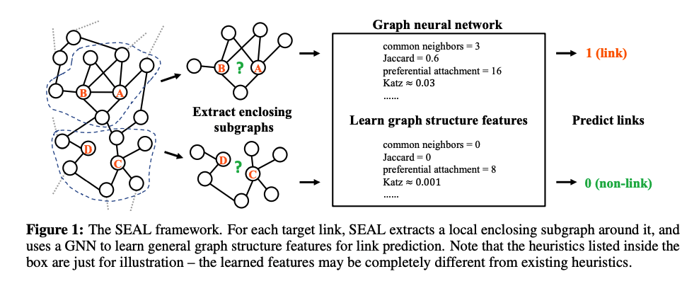

# What is link prediction? 

Link prediction is to predict whether two nodes in a network are likely to have a link [1]. 

Given the ubiquitous existence of networks, it has many applications such as friend recommendation [2], movie recommendation [3], knowledge graph completion [4], and metabolic network reconstruction [5].

In fact, the heuristics belong to a more generic class, namely graph structure features. Graph structure features are those features located inside the observed node and edge structures of the network, which can be calculated directly from the graph. Since heuristics can be viewed as predefined graph structure features, a natural idea is to automatically learn such features from the network.

# WLNM: Weisfeiler-Lehman Neural Machine

Then extract local enclosing subgraphs around links as the training data, and use a fully-connected neural network to learn which enclosing subgraphs correspond to link existence. Their method called Weisfeiler-Lehman Neural Machine (WLNM) has achieved state-of-the-art link prediction performance. The enclosing subgraph for a node pair (x, y) is the
subgraph induced from the network by the union of x and y’s neighbors up to h hops. Figure above illustrates the 1-hop enclosing subgraphs for (A, B) and (C, D). These enclosing subgraphs are very informative for link prediction – all first-order heuristics such as common neighbors can be directly calculated from the 1-hop enclosing subgraphs.

# Hop number and γ-decaying theory

To effectively learn good high-order features, it seems that we need a very large hop number h so that the enclosing subgraph becomes the entire network. This results in unaffordable time and memory consumption for most practical networks.

But do we really need such a large h to learn high-order heuristics?

Fortunately, we can show that we do not necessarily need a very large h to learn high-order graph structure features. We dive into the inherent mechanisms of link prediction heuristics, and find that most high-order heuristics can be unified by a γ-decaying theory. It proves that, under mild conditions, any γ-decaying heuristic can be effectively approximated from an h-hop enclosing subgraph, where the approximation error decreases at least exponentially with h. This means that we can safely use even a small h to learn good high-order features. It also implies that the “effective order” of these high-order heuristics is not that high.

# SEAL: Subgraphs, Embeddings, and Attributes for Link prediction

Based on our theoretical results, we propose a novel link prediction framework, SEAL, to learn general graph structure features from local enclosing subgraphs. SEAL fixes multiple drawbacks of WLNM. First, a graph neural network (GNN) [6, 7, 8, 9, 10] is used to replace the fully-connected neural network in WLNM, which enables better graph feature learning ability. Second, SEAL permits learning from not only subgraph structures, but also latent and explicit node features, thus absorbing multiple types of information. We empirically verified its much improved performance.

"Link prediction is a key problem for network-structured data. Link prediction heuristics use some score functions, such as common neighbors and Katz index, to measure the likelihood of links. They have obtained wide practical uses due to their simplicity, interpretability, and for some of them, scalability. However, every heuristic has a strong assumption on when two nodes are likely to link, which limits their effectiveness on networks where these assumptions fail. In this regard, a more reasonable way should be learning a suitable heuristic from a given network
instead of using predefined ones. By extracting a local subgraph around each target link, we aim to learn a function mapping the subgraph patterns to link existence, thus automatically learning a “heuristic” that suits the current network. This algorithm, studies this heuristic learning paradigm for link prediction. First, it develop a novel γ-decaying heuristic theory. The theory unifies a wide range of heuristics in a single framework, and proves that all these heuristics can be well approximated from local subgraphs. The results show that local subgraphs reserve
rich information related to link existence. Second, based on the γ-decaying theory, it propose a new method to learn heuristics from local subgraphs using a graph neural network (GNN). Its experimental results show unprecedented performance, working consistently well on a wide range of problems." ref: [Link Prediction Based on Graph Neural Networks](https://www.researchgate.net/profile/Muhan-Zhang/publication/323443864_Link_Prediction_Based_on_Graph_Neural_Networks/links/5dc113364585151435e9382a/Link-Prediction-Based-on-Graph-Neural-Networks.pdf).

# References

[1] David Liben-Nowell and Jon Kleinberg. The link-prediction problem for social networks. Journal of the
American society for information science and technology, 58(7):1019–1031, 2007.

[2] Lada A Adamic and Eytan Adar. Friends and neighbors on the web. Social networks, 25(3):211–230,
2003.

[3] Yehuda Koren, Robert Bell, and Chris Volinsky. Matrix factorization techniques for recommender systems.
Computer, (8):30–37, 2009.

[4] Maximilian Nickel, Kevin Murphy, Volker Tresp, and Evgeniy Gabrilovich. A review of relational machine
learning for knowledge graphs. Proceedings of the IEEE, 104(1):11–33, 2016.

[5] Tolutola Oyetunde, Muhan Zhang, Yixin Chen, Yinjie Tang, and Cynthia Lo. Boostgapfill: Improving
the fidelity of metabolic network reconstructions through integrated constraint and pattern-based methods.
Bioinformatics, 2016.

[6] Joan Bruna, Wojciech Zaremba, Arthur Szlam, and Yann LeCun. Spectral networks and locally connected
networks on graphs. arXiv preprint arXiv:1312.6203, 2013.

[7] David K Duvenaud, Dougal Maclaurin, Jorge Iparraguirre, Rafael Bombarell, Timothy Hirzel, Alán
Aspuru-Guzik, and Ryan P Adams. Convolutional networks on graphs for learning molecular fingerprints.
In Advances in neural information processing systems, pages 2224–2232, 2015.

[8] Thomas N Kipf and Max Welling. Semi-supervised classification with graph convolutional networks.
arXiv preprint arXiv:1609.02907, 2016.

[9] Mathias Niepert, Mohamed Ahmed, and Konstantin Kutzkov. Learning convolutional neural networks for
graphs. In International conference on machine learning, pages 2014–2023, 2016.

[10] Muhan Zhang, Zhicheng Cui, Marion Neumann, and Yixin Chen. An end-to-end deep learning architecture
for graph classification. In AAAI, pages 4438–4445, 2018.

