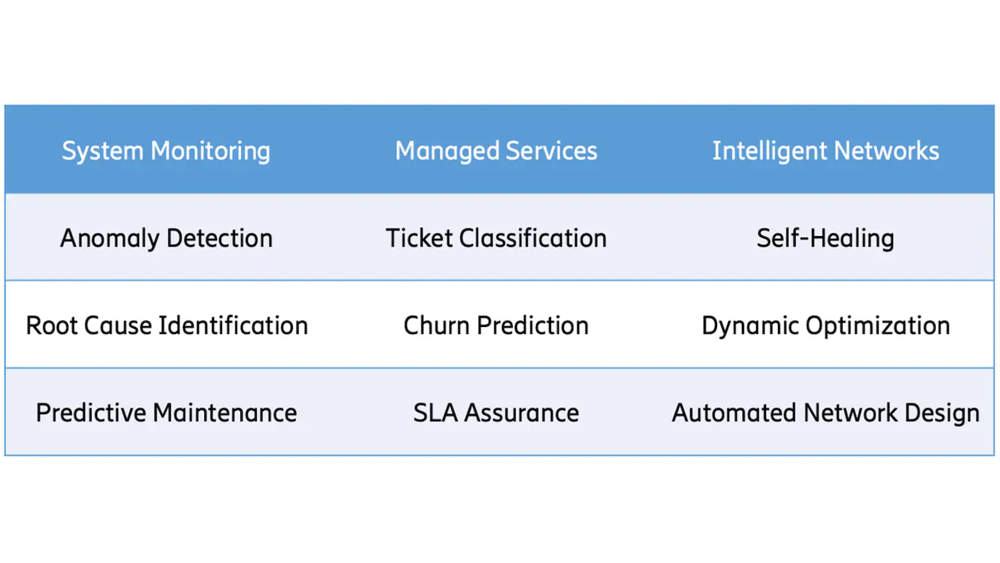

# ML4Telecom

## In the area of system monitoring,
anomaly detection systems are crucial for identifying performance issues and problematic network behavior. Proactively predicting the degradation of key performance indicators, and identifying the likely root cause, can help reduce and prevent outages.

## In the area of managed services, 
ML models can improve trouble ticket management by effectively classifying, prioritizing, and escalating incidents. Capacity planning and customer retention can be improved through explainable churn prediction.  

## In the area of intelligent networks, 
the incorporation of ML tools can enable self-healing radio networks, which automatically detect issues and take corrective actions. New technologies such as deep learning and reinforcement learning can be used to automate the network design process and optimize network performance in real time.  

